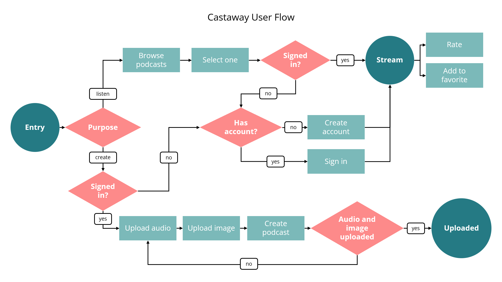

<p align="center"></p>

<h1 align="center">
  Castaway
</h1>

<h3 align="center">
  Your friendly podcast app (work in progress)
</h3>

 <br/>

<div align="center">


</div>

## Getting Started

Castaway is a podcast app that serves contents from your favorite content creators on iPhone and Android. This project is written in Express and Firebase for the backend and Flutter for the frontend.

## Installation

1. Create a Firebase project [here](https://console.firebase.google.com/u/0/) with "Add project". \*use Blaze plan or above

2. Install the latest firebase tools:

```bash
# using npm
npm install -g firebase-tools

# using yarn
yarn global add firebase-tools
```

3. Login to your Google account linked to Firebase.

```bash
firebase login:ci
```

4. Clone this repository.

```bash
## using ssh
git clone git@github.com:yyj-02/castaway-backend.git

##using https
git clone https://github.com/yyj-02/castaway-backend.git
```

5. Initializing Firebase.

```bash
firebase init
# 1. select the previously created Firebase project
# 2. enable firestore, functions, storage and their respective emulators
# 3. enable typescript but don't enable linting service
```

6. Installing dependencies.

```bash
cd functions/

# using npm
npm install

# using yarn
yarn add
```

7. Add a Google Identity Server [here](https://console.cloud.google.com/customer-identity) to your previously created project, copy the {apiKey} in "APPLICATION SETUP DETAILS". And in "Add provider", select "email and password".

8. Configuring the identity server.

```bash
# in functions/
touch .env
```

In the `.env` file, add this line and replace the apiKey without the brackets.

```dotenv
IDENTITY_SERVER_API_KEY="{apiKey}"
```

9. Running the emulators. \*note that the authentication does not have an emulator so it will be synced to the actual database

```bash
# in functions/
npm run serve
```

10. Deploying to the cloud.

```bash
# in functions/
npm run deploy
```

## System Design


<details>
<summary><h3 style="display: inline;">Design Considerations</h3></summary>

We have employed [Headless CMS](https://www.contentful.com/r/knowledgebase/what-is-headless-cms/) for our Castaway application for increased flexibility and scalability, especially if we decided to create a web app in the future. Hence, the frontend will communicate with a backend API to exchange information, and render it on the devices. By making the API the single entry point into our backend service also improves security as the clients cannot communicate with the database and storage directly.

Firebase was chosen to be the platform to host the backend due to its wide range of utilities, ranging from [Firestore](https://firebase.google.com/docs/firestore), [Cloud Storage](https://firebase.google.com/docs/storage), [Cloud Messaging](https://firebase.google.com/docs/cloud-messaging/) and [Authentication Service](https://cloud.google.com/identity-platform). This and its security features make rapid prototyping possible, which is advantageous for us as we want to push features fast without worrying about the implementations. 

[REST API](https://www.redhat.com/en/topics/api/what-is-a-rest-api) is used for the different resources, such as the podcasts and users, as they provide a great deal of flexibility and is easier to debug. Besides, the backend code is organized using an architecture similar to the [MVC](https://developer.mozilla.org/en-US/docs/Glossary/MVC). The routers pass the request to the controllers, which breakdown the http request. Then, the services contain the business logic to be used by the controllers. Lastly, the model will provide the data needed to the services. All these design considerations are chosen to maximize scalability in the long run, by making the code easier to manage and debug.

As shown in the diagram, Cloud Storage will contain all the files such as audio and image files while the Firestore will contain the information about the users and podcasts. The Cloud Messaging will act as a [signalling server](https://developer.mozilla.org/en-US/docs/Web/API/WebRTC_API/Signaling_and_video_calling) which is essential in establishing a successful [WebRTC](https://webrtc.org/) connection between the clients.
</details>

<br>

## Database Schema


## User Flow



## Software Engineering Practices

to be continue >>

## Backend Documentation

[go to API documentation →](./functions/README.md)

## Frontend Documentation

[go to backend documentation →](https://github.com/yyj-02/castaway-frontend#readme)
