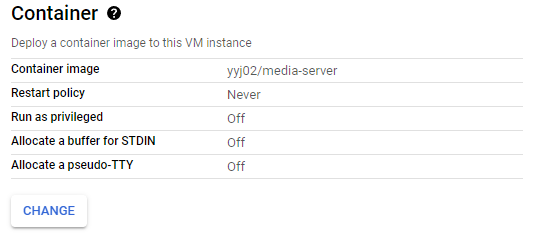
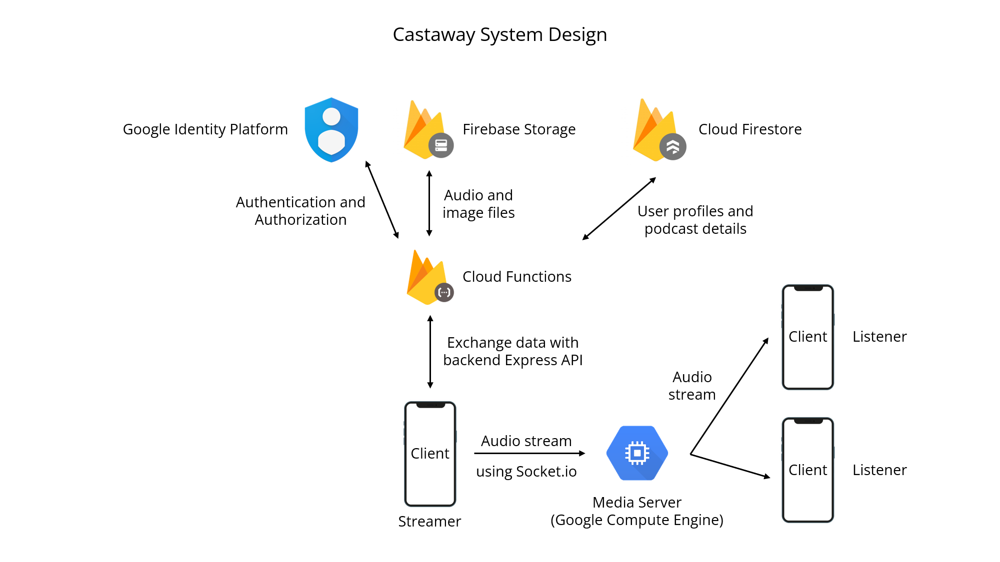

<p align="center"></p>

<h1 align="center">
  Castaway
</h1>

<h3 align="center">
  Your friendly podcast app (work in progress)
</h3>

 <br/>

<div align="center">


</div>

## Getting Started

Castaway is a podcast app that serves contents from your favorite content creators on iPhone and Android. This project is written in Express and Firebase for the backend and Flutter for the frontend.

## Installation

1. Create a Firebase project [here](https://console.firebase.google.com/u/0/) with "Add project". \*use Blaze plan or above

2. Install the latest firebase tools:

```bash
# using npm
npm install -g firebase-tools

# using yarn
yarn global add firebase-tools
```

3. Login to your Google account linked to Firebase.

```bash
firebase login:ci
```

4. Clone this repository.

```bash
## using ssh
git clone git@github.com:yyj-02/castaway-backend.git

##using https
git clone https://github.com/yyj-02/castaway-backend.git
```

5. Initializing Firebase.

```bash
firebase init
# 1. select the previously created Firebase project
# 2. enable firestore, functions, storage and their respective emulators
# 3. enable typescript but don't enable linting service
```

6. Installing dependencies.

```bash
cd functions/

# using npm
npm install

# using yarn
yarn add
```

7. Add a Google Identity Server [here](https://console.cloud.google.com/customer-identity) to your previously created project, copy the {apiKey} in "APPLICATION SETUP DETAILS". And in "Add provider", select "email and password".

8. Configuring the identity server.

```bash
# in functions/
touch .env
```

In the `.env` file, add this line and replace the apiKey without the brackets.

```dotenv
IDENTITY_SERVER_API_KEY="{apiKey}"
```

9. Running the emulators. \*note that the authentication does not have an emulator so it will be synced to the actual database

```bash
# in functions/
npm run serve
```

10. Deploying to the cloud.

```bash
# in functions/
npm run deploy
```

11. Creating compute engine [here](https://cloud.google.com/compute).

12. Setting up networking and firewall rules.

Create an external ip endpoint for your compute engine [here](https://cloud.google.com/compute/docs/ip-addresses/reserve-static-external-ip-address).

Create firewall rules to expose ports 8080, 3000 tcp using this [guide](https://www.howtogeek.com/devops/how-to-open-firewall-ports-on-a-gcp-compute-engine-instance/#:~:text=Opening%20Ports%20with%20Firewall%20Rules,to%20allow%20or%20deny%20traffic.)

13. Setting up the media server.

Configure the docker image for the compute engine here. VM-instance tab -> Edit -> Container -> Change



Container image: yyj02/media-server

Environment variables:

```
IDENTITY_SERVER_API_KEY = {the google identity server api key}
PROJECT_ID = {obtained from firebase console Projects settings -> Service accounts -> Generate new private key}
PRIVATE_KEY = {same as above, without the ---Begin private key--- and ---End private key---}
CLIENT_EMAIL = {same as above}
```

Find private key here:


Sample setup:


## System Design



<details>
<summary><h3 style="display: inline;">Design Considerations</h3></summary>

We have employed [Headless CMS](https://www.contentful.com/r/knowledgebase/what-is-headless-cms/) for our Castaway application for increased flexibility and scalability, especially if we decided to create a web app in the future. Hence, the frontend will communicate with a backend API to exchange information, and render it on the devices. By making the API the single entry point into our backend service also improves security as the clients cannot communicate with the database and storage directly.

Firebase was chosen to be the platform to host the backend due to its wide range of utilities, ranging from [Firestore](https://firebase.google.com/docs/firestore), [Cloud Storage](https://firebase.google.com/docs/storage), [Cloud Messaging](https://firebase.google.com/docs/cloud-messaging/) and [Authentication Service](https://cloud.google.com/identity-platform). This and its security features make rapid prototyping possible, which is advantageous for us as we want to push features fast without worrying about the implementations. 

[REST API](https://www.redhat.com/en/topics/api/what-is-a-rest-api) is used for the different resources, such as the podcasts and users, as they provide a great deal of flexibility and is easier to debug. Besides, the backend code is organized using an architecture similar to the [MVC](https://developer.mozilla.org/en-US/docs/Glossary/MVC). The routers in the `routes/` folder pass the request to the controllers in the `controllers/` folder, which breakdown the http request. Then, the services in the `services/` folder contain the business logic to be used by the controllers. Lastly, the model will provide the data needed to the services. On top of that, all the files will only be responsible for only one resources (e.g. podcasts) to prevent cross-contamination between the resources. All these design considerations are chosen to maximize scalability in the long run, by making the code easier to manage and debug.

As shown in the diagram, Cloud Storage will contain all the files such as audio and image files while the Firestore will contain the information about the users and podcasts. The Cloud Messaging will act as a [signalling server](https://developer.mozilla.org/en-US/docs/Web/API/WebRTC_API/Signaling_and_video_calling) which is essential in establishing a successful [WebRTC](https://webrtc.org/) connection between the clients.

For the livestreaming service, we have decided to use a [Selective Forwarding Unit](https://www.callstats.io/blog/webrtc-architectures-explained-in-5-minutes-or-less#:~:text=Selective%20Forwarding%20Units%20(SFUs)%20are,via%20the%20same%20central%20server.) model. This is chosen to maximize security as the clients are not able to send packages directly to the listeners but have to pass through our server first instead. Another consideration is that by using a SFU server, the workload on the client's device can be reduced as instead of broadcasting to large number of listeners separately using the Mesh model, they only need to send the audio packets to the server once and the server will distribute the packages.
</details>

<br>

## Database Schema


<details>
<summary><h3 style="display: inline;">Design Considerations</h3></summary>

Firestore is used to store the information about the users and podcasts while Cloud Storage is used to store the files.

One different thing in this schema as compared to convention is that the artist name is stored in both podcasts and users. This is the design choice as if the artist name is only stored in the users database, we need two Firestore calls for each podcast, using more of our limited Firestore credit. Since the artist name will have a lot more reads than writes, we have decided to put it in the podcasts database as well.
</details>

<br>

## User Flow


## Software Engineering Practices

to be continue >>
- [ ] AGILE
- [ ] Google Key exposed
- [ ] Kanban
- [ ] Server client model
- [ ] Typescript

## Backend Documentation

[go to API documentation →](./functions/README.md)

[go to media server documentation →](./media_server/README.md)

## Frontend Documentation

[go to frontend documentation →](https://github.com/yyj-02/castaway-frontend#readme)
